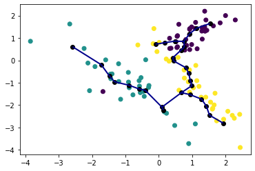

[](https://pypi.python.org/pypi/simpleppt/)
[](https://github.com/LouisFaure/simpleppt/actions/workflows/install.yml)
[](https://github.com/LouisFaure/simpleppt/blob/master/LICENSE)

# SimplePPT
Python implementation of [SimplePPT algorithm](https://doi.org/10.1137/1.9781611974010.89), with GPU acceleration.

Please cite the following paper if you use it:
```
Mao et al. (2015), SimplePPT: A simple principal tree algorithm, SIAM International Conference on Data Mining.
```

Installation
------------

```bash
pip install -U simpleppt
```

Usage
-----

```python
from sklearn.datasets import make_classification
import simpleppt

X1, Y1 = make_classification(n_features=2, n_redundant=0, n_informative=2,
                             n_clusters_per_class=1, n_classes=3)

ppt=simpleppt.ppt(X1,Nodes=30,seed=1,progress=False,lam=10)
simpleppt.project_ppt(ppt,X1, c=Y1)
```




GPU dependencies (optional)
---------------------------

If you have a nvidia GPU, simpleppt can leverage CUDA computations for speedup in tree inference. The latest version of rapids framework is required (at least 0.17) it is recommanded to create a new conda environment:

    conda create -n SimplePPT-gpu -c rapidsai -c nvidia -c conda-forge -c defaults \
        rapids=0.19 python=3.8 cudatoolkit=11.0 -y
    conda activate SimplePPT-gpu
    pip install simpleppt
